# Activity Diagrams — Ninh Kieu Pharma

The diagrams below map to UC-01 through UC-19 in section 3 of FORM 02A.
Each diagram is written in Mermaid `flowchart TD` syntax. Input and output
activities use parallelograms; process activities use rectangles, decisions use
diamonds, and the start/end nodes use rounded shapes.

## UC-01 — Employee Records, Accounts, and Roles

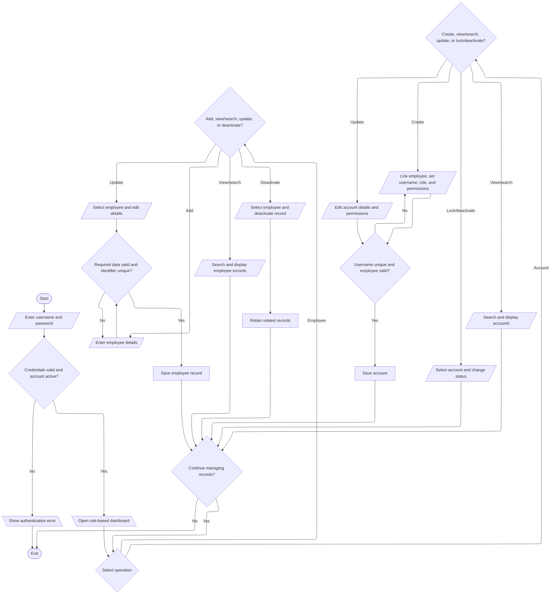
```mermaid
%%{init: {"layout": "elk", "flowchart": {"nodeSpacing": 70, "rankSpacing": 90, "htmlLabels": false}}}%%
flowchart TD
    A([Start]) --> B[/Enter username and password/]
    B --> C{"Credentials valid and account active?"}
    C -- No --> D[\Show authentication error\]
    D --> Z([End])
    C -- Yes --> E[\Open role-based dashboard\]
    E --> F{"Select operation"}
    F -- Employee --> G{"Add, view/search, update, or deactivate?"}
    G -- Add --> H[/Enter employee details/]
    H --> I{"Required data valid and identifier unique?"}
    I -- No --> H
    I -- Yes --> J["Save employee record"]
    G -- View/search --> K[/Search and display employee records/]
    G -- Update --> L[/Select employee and edit details/]
    L --> I
    G -- Deactivate --> M[/Select employee and deactivate record/]
    M --> N["Retain related records"]
    F -- Account --> O{"Create, view/search, update, or lock/deactivate?"}
    O -- Create --> P[/Link employee, set username, role, and permissions/]
    P --> Q{"Username unique and employee valid?"}
    Q -- No --> P
    Q -- Yes --> R["Save account"]
    O -- View/search --> S[/Search and display accounts/]
    O -- Update --> T[/Edit account details and permissions/]
    T --> Q
    O -- Lock/deactivate --> U[/Select account and change status/]
    J --> V{"Continue managing records?"}
    K --> V
    N --> V
    R --> V
    S --> V
    U --> V
    V -- Yes --> F
    V -- No --> Z
```

## UC-02 — Employee Availability

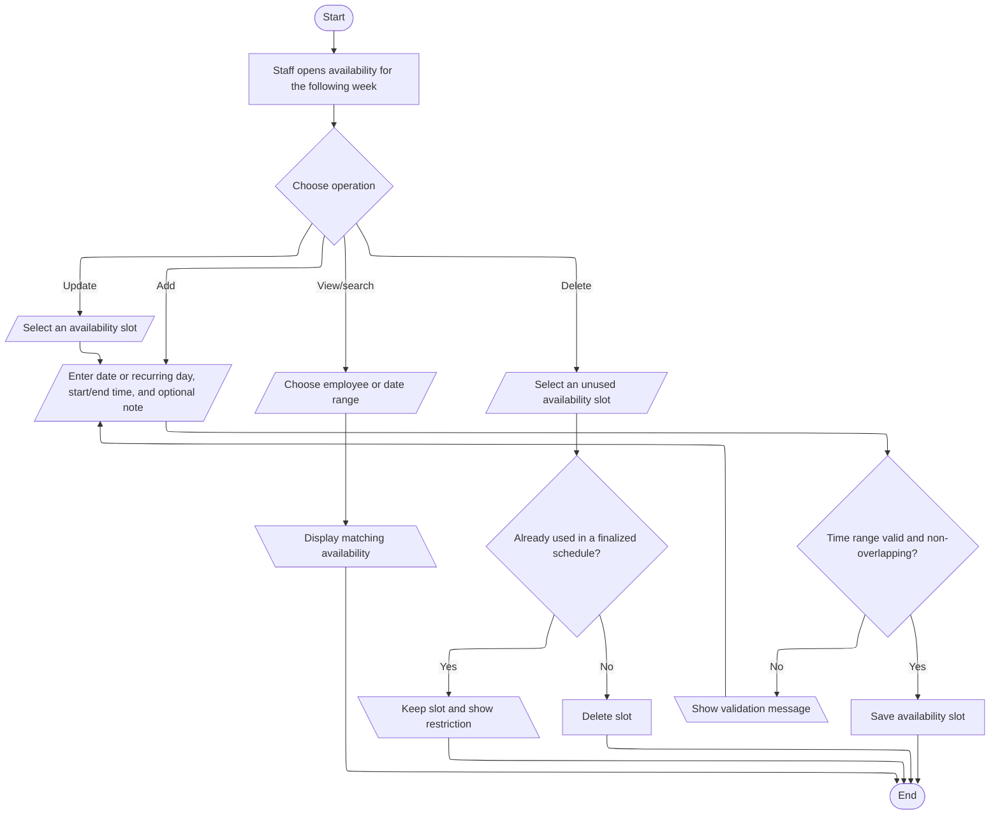
```mermaid
%%{init: {"layout": "elk", "flowchart": {"nodeSpacing": 70, "rankSpacing": 90, "htmlLabels": false}}}%%
flowchart TD
    A([Start]) --> B["Staff opens availability for the following week"]
    B --> C{"Choose operation"}
    C -- Add --> D[/Enter date or recurring day, start/end time, and optional note/]
    C -- View/search --> E[/Choose employee or date range/]
    E --> F[\Display matching availability\]
    C -- Update --> G[/Select an availability slot/]
    G --> D
    C -- Delete --> H[/Select an unused availability slot/]
    H --> I{"Already used in a finalized schedule?"}
    I -- Yes --> J[\Keep slot and show restriction\]
    I -- No --> K["Delete slot"]
    D --> L{"Time range valid and non-overlapping?"}
    L -- No --> M[\Show validation message\]
    M --> D
    L -- Yes --> N["Save availability slot"]
    F --> Z([End])
    J --> Z
    K --> Z
    N --> Z
```

## UC-03 — Shift Scheduling

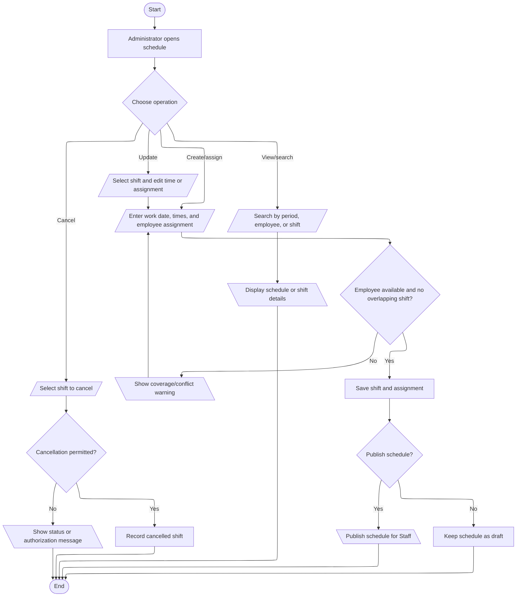
```mermaid
%%{init: {"layout": "elk", "flowchart": {"nodeSpacing": 70, "rankSpacing": 90, "htmlLabels": false}}}%%
flowchart TD
    A([Start]) --> B["Administrator opens schedule"]
    B --> C{"Choose operation"}
    C -- Create/assign --> D[/Enter work date, times, and employee assignment/]
    C -- View/search --> E[/Search by period, employee, or shift/]
    E --> F[\Display schedule or shift details\]
    C -- Update --> G[/Select shift and edit time or assignment/]
    G --> D
    C -- Cancel --> H[/Select shift to cancel/]
    H --> I{"Cancellation permitted?"}
    I -- No --> J[\Show status or authorization message\]
    I -- Yes --> K["Record cancelled shift"]
    D --> L{"Employee available and no overlapping shift?"}
    L -- No --> M[\Show coverage/conflict warning\]
    M --> D
    L -- Yes --> N["Save shift and assignment"]
    N --> O{"Publish schedule?"}
    O -- Yes --> P[\Publish schedule for Staff\]
    O -- No --> Q["Keep schedule as draft"]
    F --> Z([End])
    J --> Z
    K --> Z
    P --> Z
    Q --> Z
```

## UC-04 — Attendance

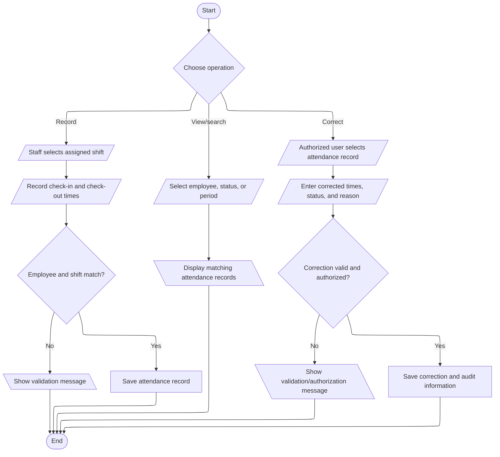
```mermaid
%%{init: {"layout": "elk", "flowchart": {"nodeSpacing": 70, "rankSpacing": 90, "htmlLabels": false}}}%%
flowchart TD
    A([Start]) --> B{"Choose operation"}
    B -- Record --> C[/Staff selects assigned shift/]
    C --> D[/Record check-in and check-out times/]
    D --> E{"Employee and shift match?"}
    E -- No --> F[\Show validation message\]
    E -- Yes --> G["Save attendance record"]
    B -- View/search --> H[/Select employee, status, or period/]
    H --> I[\Display matching attendance records\]
    B -- Correct --> J[/Authorized user selects attendance record/]
    J --> K[/Enter corrected times, status, and reason/]
    K --> L{"Correction valid and authorized?"}
    L -- No --> M[\Show validation/authorization message\]
    L -- Yes --> N["Save correction and audit information"]
    F --> Z([End])
    G --> Z
    I --> Z
    M --> Z
    N --> Z
```

## UC-05 — Work Hours, Payroll, and Commissions

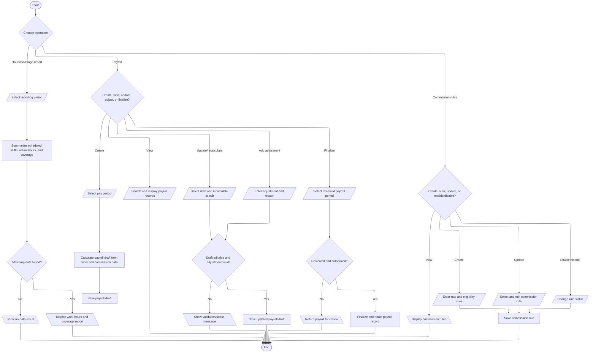
```mermaid
%%{init: {"layout": "elk", "flowchart": {"nodeSpacing": 70, "rankSpacing": 90, "htmlLabels": false}}}%%
flowchart TD
    A([Start]) --> B{"Choose operation"}
    B -- Hours/coverage report --> C[/Select reporting period/]
    C --> D["Summarize scheduled shifts, actual hours, and coverage"]
    D --> E{"Matching data found?"}
    E -- No --> F[\Show no-data result\]
    E -- Yes --> G[\Display work-hours and coverage report\]
    B -- Payroll --> H{"Create, view, update, adjust, or finalize?"}
    H -- Create --> I[/Select pay period/]
    I --> J["Calculate payroll draft from work and commission data"]
    J --> K["Save payroll draft"]
    H -- View --> L[/Search and display payroll records/]
    H -- Update/recalculate --> M[/Select draft and recalculate or edit/]
    H -- Add adjustment --> N[/Enter adjustment and reason/]
    N --> O{"Draft editable and adjustment valid?"}
    M --> O
    O -- No --> P[\Show validation/status message\]
    O -- Yes --> Q["Save updated payroll draft"]
    H -- Finalize --> R[/Select reviewed payroll period/]
    R --> S{"Reviewed and authorized?"}
    S -- No --> T[\Return payroll for review\]
    S -- Yes --> U["Finalize and retain payroll record"]
    B -- Commission rules --> V{"Create, view, update, or enable/disable?"}
    V -- Create --> W[/Enter rate and eligibility rules/]
    V -- View --> X[\Display commission rules\]
    V -- Update --> Y[/Select and edit commission rule/]
    V -- Enable/disable --> AA[/Change rule status/]
    W --> AB["Save commission rule"]
    Y --> AB
    AA --> AB
    F --> Z([End])
    G --> Z
    L --> Z
    P --> Z
    Q --> Z
    T --> Z
    U --> Z
    X --> Z
    AB --> Z
```

## UC-06 — Schedule Compliance and Punctuality Reports

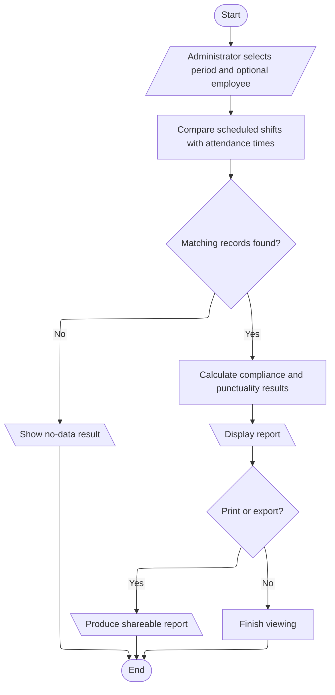
```mermaid
%%{init: {"layout": "elk", "flowchart": {"nodeSpacing": 70, "rankSpacing": 90, "htmlLabels": false}}}%%
flowchart TD
    A([Start]) --> B[/Administrator selects period and optional employee/]
    B --> C["Compare scheduled shifts with attendance times"]
    C --> D{"Matching records found?"}
    D -- No --> E[\Show no-data result\]
    D -- Yes --> F["Calculate compliance and punctuality results"]
    F --> G[\Display report\]
    G --> H{"Print or export?"}
    H -- Yes --> I[\Produce shareable report\]
    H -- No --> J["Finish viewing"]
    E --> Z([End])
    I --> Z
    J --> Z
```

## UC-07 — Product Categories

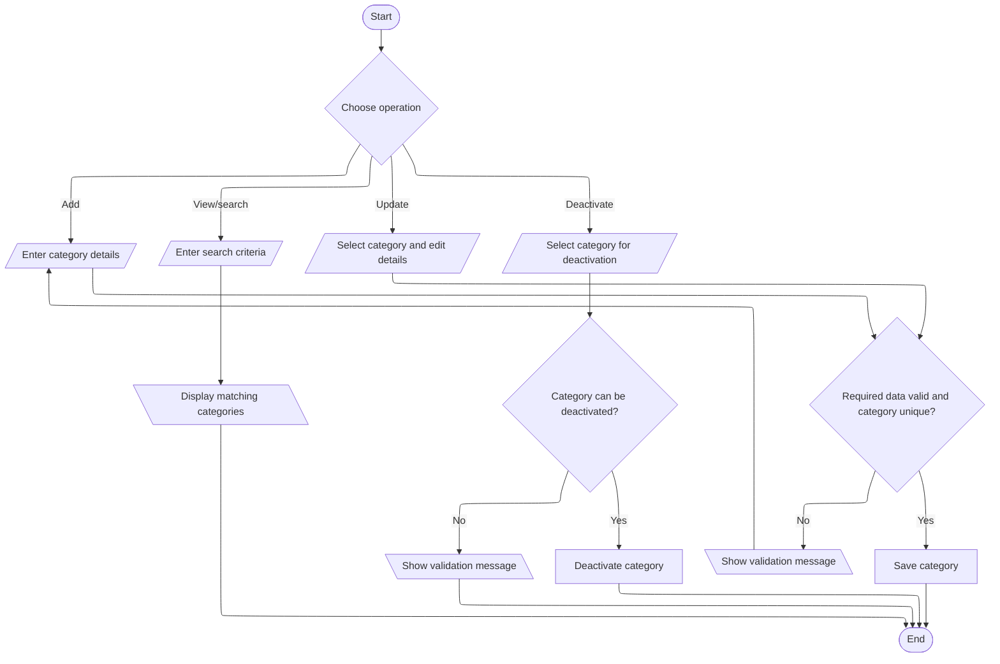
```mermaid
%%{init: {"layout": "elk", "flowchart": {"nodeSpacing": 70, "rankSpacing": 90, "htmlLabels": false}}}%%
flowchart TD
    A([Start]) --> B{"Choose operation"}
    B -- Add --> C[/Enter category details/]
    B -- View/search --> D[/Enter search criteria/]
    D --> E[\Display matching categories\]
    B -- Update --> F[/Select category and edit details/]
    B -- Deactivate --> G[/Select category for deactivation/]
    G --> H{"Category can be deactivated?"}
    H -- No --> I[\Show validation message\]
    H -- Yes --> J["Deactivate category"]
    C --> K{"Required data valid and category unique?"}
    F --> K
    K -- No --> L[\Show validation message\]
    L --> C
    K -- Yes --> M["Save category"]
    E --> Z([End])
    I --> Z
    J --> Z
    M --> Z
```

## UC-08 — Products

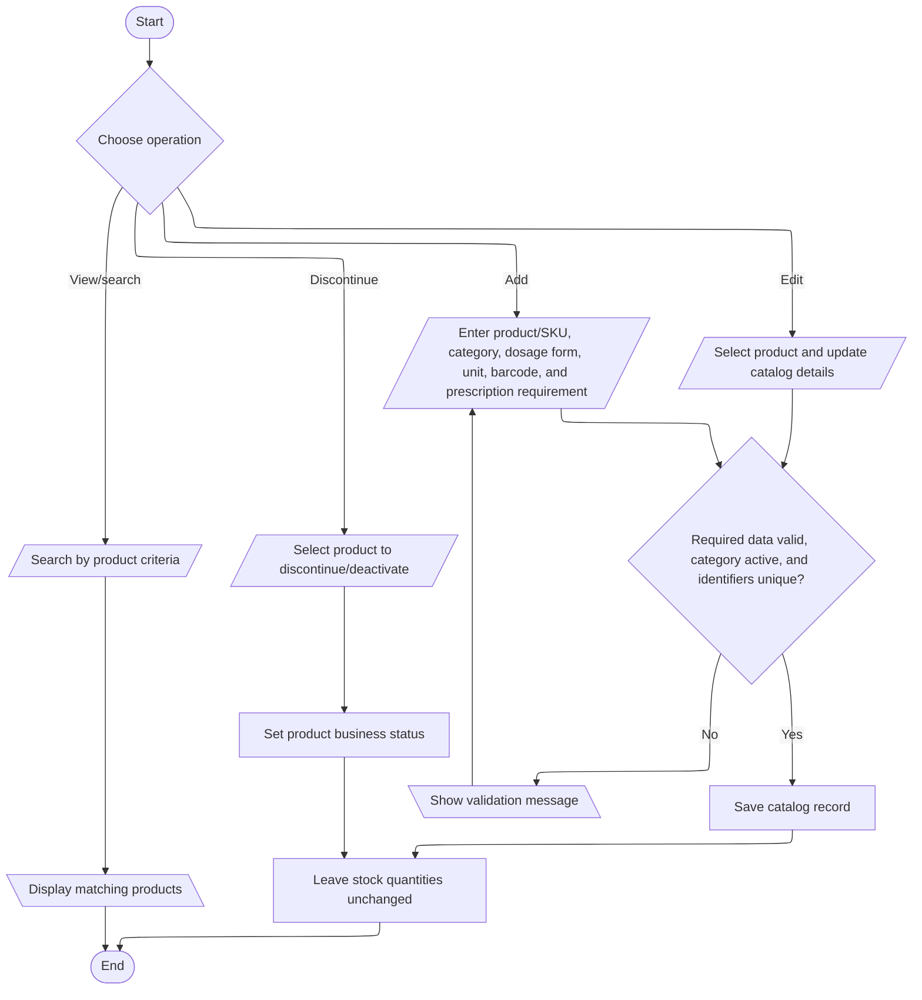
```mermaid
%%{init: {"layout": "elk", "flowchart": {"nodeSpacing": 70, "rankSpacing": 90, "htmlLabels": false}}}%%
flowchart TD
    A([Start]) --> B{"Choose operation"}
    B -- Add --> C[/Enter product/SKU, category, dosage form, unit, barcode, and prescription requirement/]
    B -- View/search --> D[/Search by product criteria/]
    D --> E[\Display matching products\]
    B -- Edit --> F[/Select product and update catalog details/]
    B -- Discontinue --> G[/Select product to discontinue/deactivate/]
    C --> H{"Required data valid, category active, and identifiers unique?"}
    F --> H
    H -- No --> I[\Show validation message\]
    I --> C
    H -- Yes --> J["Save catalog record"]
    G --> K["Set product business status"]
    J --> L["Leave stock quantities unchanged"]
    E --> Z([End])
    K --> L
    L --> Z
```

## UC-09 — Suppliers

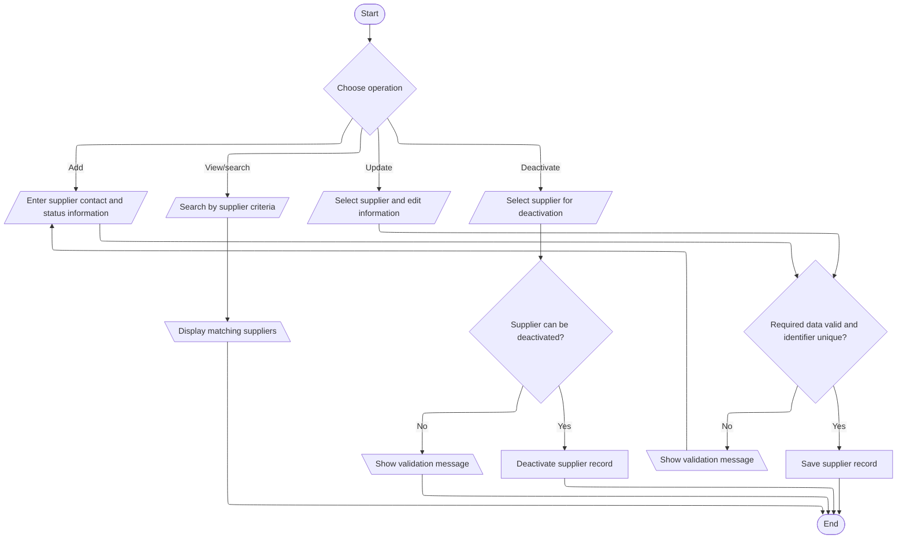
```mermaid
%%{init: {"layout": "elk", "flowchart": {"nodeSpacing": 70, "rankSpacing": 90, "htmlLabels": false}}}%%
flowchart TD
    A([Start]) --> B{"Choose operation"}
    B -- Add --> C[/Enter supplier contact and status information/]
    B -- View/search --> D[/Search by supplier criteria/]
    D --> E[\Display matching suppliers\]
    B -- Update --> F[/Select supplier and edit information/]
    B -- Deactivate --> G[/Select supplier for deactivation/]
    G --> H{"Supplier can be deactivated?"}
    H -- No --> I[\Show validation message\]
    H -- Yes --> J["Deactivate supplier record"]
    C --> K{"Required data valid and identifier unique?"}
    F --> K
    K -- No --> L[\Show validation message\]
    L --> C
    K -- Yes --> M["Save supplier record"]
    E --> Z([End])
    I --> Z
    J --> Z
    M --> Z
```

## UC-10 — Category Trend Reports

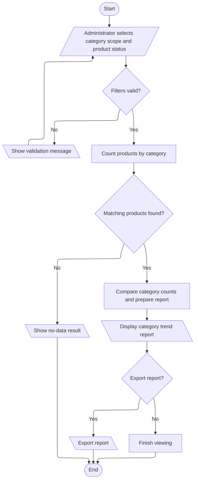
```mermaid
%%{init: {"layout": "elk", "flowchart": {"nodeSpacing": 70, "rankSpacing": 90, "htmlLabels": false}}}%%
flowchart TD
    A([Start]) --> B[/Administrator selects category scope and product status/]
    B --> C{"Filters valid?"}
    C -- No --> D[\Show validation message\]
    D --> B
    C -- Yes --> E["Count products by category"]
    E --> F{"Matching products found?"}
    F -- No --> G[\Show no-data result\]
    F -- Yes --> H["Compare category counts and prepare report"]
    H --> I[\Display category trend report\]
    I --> J{"Export report?"}
    J -- Yes --> K[\Export report\]
    J -- No --> L["Finish viewing"]
    G --> Z([End])
    K --> Z
    L --> Z
```

## UC-11 — Supplier Coverage Reports

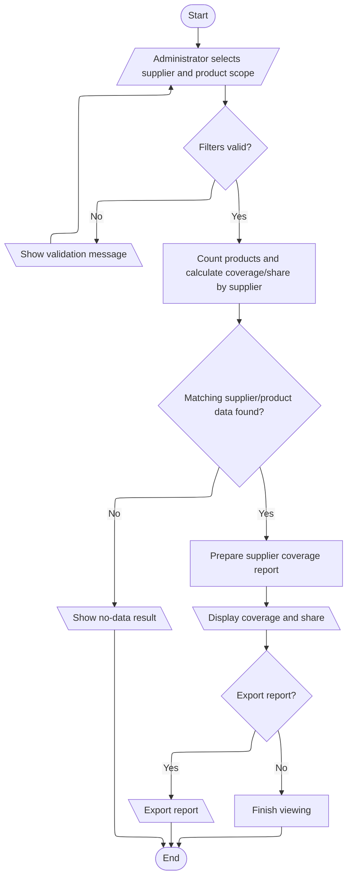
```mermaid
%%{init: {"layout": "elk", "flowchart": {"nodeSpacing": 70, "rankSpacing": 90, "htmlLabels": false}}}%%
flowchart TD
    A([Start]) --> B[/Administrator selects supplier and product scope/]
    B --> C{"Filters valid?"}
    C -- No --> D[\Show validation message\]
    D --> B
    C -- Yes --> E["Count products and calculate coverage/share by supplier"]
    E --> F{"Matching supplier/product data found?"}
    F -- No --> G[\Show no-data result\]
    F -- Yes --> H["Prepare supplier coverage report"]
    H --> I[\Display coverage and share\]
    I --> J{"Export report?"}
    J -- Yes --> K[\Export report\]
    J -- No --> L["Finish viewing"]
    G --> Z([End])
    K --> Z
    L --> Z
```

## UC-12 — Stock Receipts

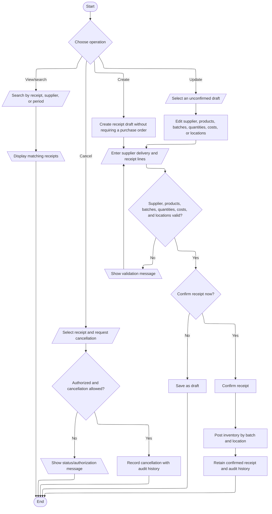
```mermaid
%%{init: {"layout": "elk", "flowchart": {"nodeSpacing": 70, "rankSpacing": 90, "htmlLabels": false}}}%%
flowchart TD
    A([Start]) --> B{"Choose operation"}
    B -- Create --> C["Create receipt draft without requiring a purchase order"]
    B -- View/search --> D[/Search by receipt, supplier, or period/]
    D --> E[\Display matching receipts\]
    B -- Update --> F[/Select an unconfirmed draft/]
    F --> G["Edit supplier, products, batches, quantities, costs, or locations"]
    B -- Cancel --> H[/Select receipt and request cancellation/]
    H --> I{"Authorized and cancellation allowed?"}
    I -- No --> J[\Show status/authorization message\]
    I -- Yes --> K["Record cancellation with audit history"]
    C --> L[/Enter supplier delivery and receipt lines/]
    G --> L
    L --> M{"Supplier, products, batches, quantities, costs, and locations valid?"}
    M -- No --> N[\Show validation message\]
    N --> L
    M -- Yes --> O{"Confirm receipt now?"}
    O -- No --> P["Save as draft"]
    O -- Yes --> Q["Confirm receipt"]
    Q --> R["Post inventory by batch and location"]
    R --> S["Retain confirmed receipt and audit history"]
    E --> Z([End])
    J --> Z
    K --> Z
    P --> Z
    S --> Z
```

## UC-13 — Storage Locations

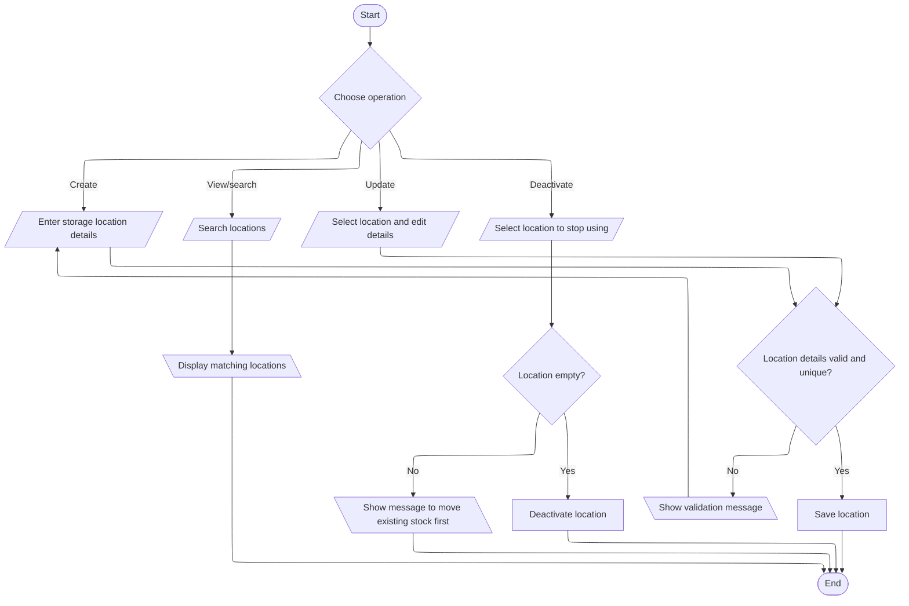
```mermaid
%%{init: {"layout": "elk", "flowchart": {"nodeSpacing": 70, "rankSpacing": 90, "htmlLabels": false}}}%%
flowchart TD
    A([Start]) --> B{"Choose operation"}
    B -- Create --> C[/Enter storage location details/]
    B -- View/search --> D[/Search locations/]
    D --> E[\Display matching locations\]
    B -- Update --> F[/Select location and edit details/]
    B -- Deactivate --> G[/Select location to stop using/]
    G --> H{"Location empty?"}
    H -- No --> I[\Show message to move existing stock first\]
    H -- Yes --> J["Deactivate location"]
    C --> K{"Location details valid and unique?"}
    F --> K
    K -- No --> L[\Show validation message\]
    L --> C
    K -- Yes --> M["Save location"]
    E --> Z([End])
    I --> Z
    J --> Z
    M --> Z
```

## UC-14 — Stocktaking and Adjustments

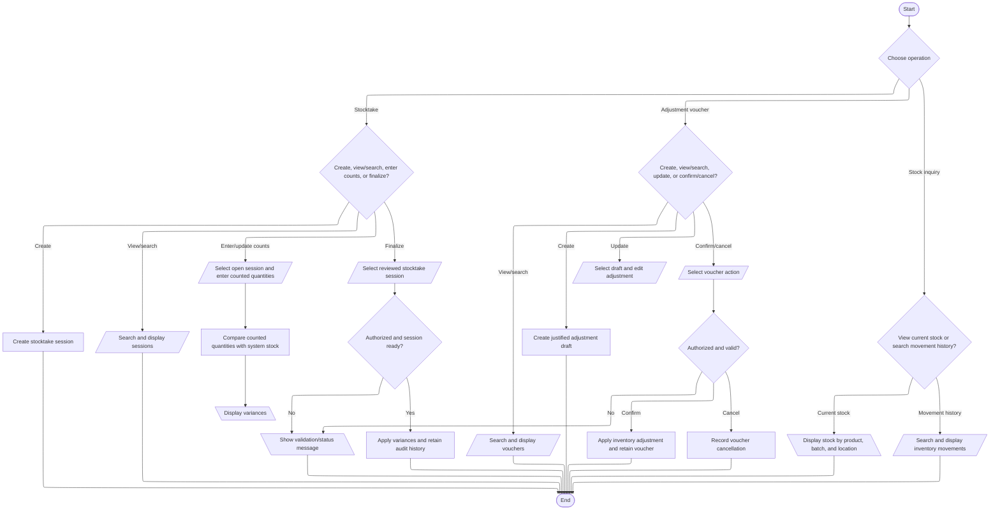
```mermaid
%%{init: {"layout": "elk", "flowchart": {"nodeSpacing": 70, "rankSpacing": 90, "htmlLabels": false}}}%%
flowchart TD
    A([Start]) --> B{"Choose operation"}
    B -- Stocktake --> C{"Create, view/search, enter counts, or finalize?"}
    C -- Create --> D["Create stocktake session"]
    C -- View/search --> E[/Search and display sessions/]
    C -- Enter/update counts --> F[/Select open session and enter counted quantities/]
    F --> G["Compare counted quantities with system stock"]
    G --> H[\Display variances\]
    C -- Finalize --> I[/Select reviewed stocktake session/]
    I --> J{"Authorized and session ready?"}
    J -- No --> K[\Show validation/status message\]
    J -- Yes --> L["Apply variances and retain audit history"]
    B -- Adjustment voucher --> M{"Create, view/search, update, or confirm/cancel?"}
    M -- Create --> N["Create justified adjustment draft"]
    M -- View/search --> O[/Search and display vouchers/]
    M -- Update --> P[/Select draft and edit adjustment/]
    M -- Confirm/cancel --> Q[/Select voucher action/]
    Q --> R{"Authorized and valid?"}
    R -- No --> K
    R -- Confirm --> S["Apply inventory adjustment and retain voucher"]
    R -- Cancel --> T["Record voucher cancellation"]
    B -- Stock inquiry --> U{"View current stock or search movement history?"}
    U -- Current stock --> V[\Display stock by product, batch, and location\]
    U -- Movement history --> W[/Search and display inventory movements/]
    E --> Z([End])
    D --> Z
    K --> Z
    L --> Z
    N --> Z
    O --> Z
    S --> Z
    T --> Z
    V --> Z
    W --> Z
```

## UC-15 — Inventory Movement and Expiry Reports

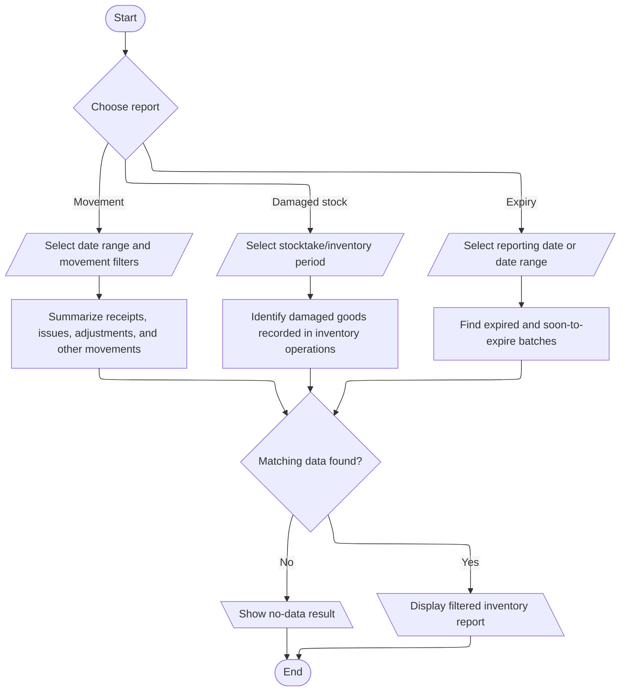
```mermaid
%%{init: {"layout": "elk", "flowchart": {"nodeSpacing": 70, "rankSpacing": 90, "htmlLabels": false}}}%%
flowchart TD
    A([Start]) --> B{"Choose report"}
    B -- Movement --> C[/Select date range and movement filters/]
    B -- Damaged stock --> D[/Select stocktake/inventory period/]
    B -- Expiry --> E[/Select reporting date or date range/]
    C --> F["Summarize receipts, issues, adjustments, and other movements"]
    D --> G["Identify damaged goods recorded in inventory operations"]
    E --> H["Find expired and soon-to-expire batches"]
    F --> I{"Matching data found?"}
    G --> I
    H --> I
    I -- No --> J[\Show no-data result\]
    I -- Yes --> K[\Display filtered inventory report\]
    J --> Z([End])
    K --> Z
```

## UC-16 — Customer Profiles, Allergies, and Loyalty Points

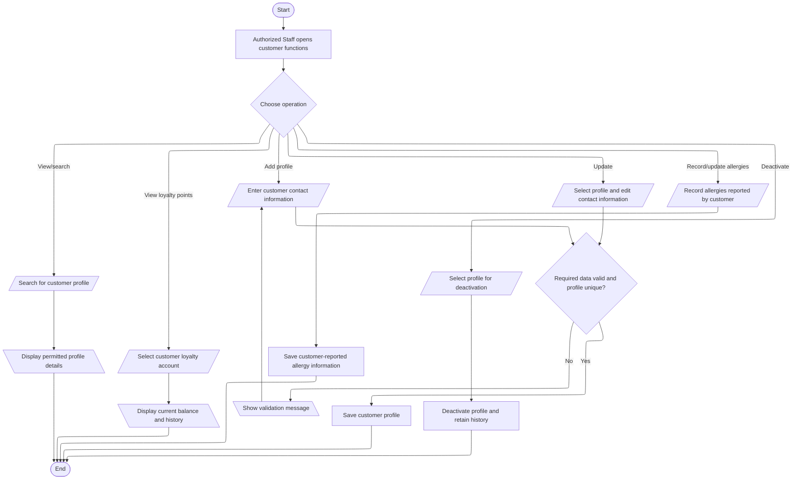
```mermaid
%%{init: {"layout": "elk", "flowchart": {"nodeSpacing": 70, "rankSpacing": 90, "htmlLabels": false}}}%%
flowchart TD
    A([Start]) --> B["Authorized Staff opens customer functions"]
    B --> C{"Choose operation"}
    C -- Add profile --> D[/Enter customer contact information/]
    C -- View/search --> E[/Search for customer profile/]
    E --> F[\Display permitted profile details\]
    C -- Update --> G[/Select profile and edit contact information/]
    C -- Deactivate --> H[/Select profile for deactivation/]
    C -- Record/update allergies --> I[/Record allergies reported by customer/]
    C -- View loyalty points --> J[/Select customer loyalty account/]
    J --> K[\Display current balance and history\]
    D --> L{"Required data valid and profile unique?"}
    G --> L
    L -- No --> M[\Show validation message\]
    M --> D
    L -- Yes --> N["Save customer profile"]
    H --> O["Deactivate profile and retain history"]
    I --> P["Save customer-reported allergy information"]
    F --> Z([End])
    K --> Z
    N --> Z
    O --> Z
    P --> Z
```

## UC-17 — Sales Transactions

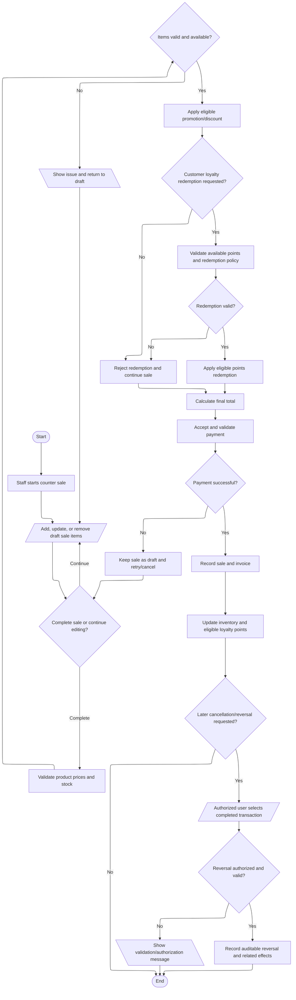
```mermaid
%%{init: {"layout": "elk", "flowchart": {"nodeSpacing": 70, "rankSpacing": 90, "htmlLabels": false}}}%%
flowchart TD
    A([Start]) --> B["Staff starts counter sale"]
    B --> C[/Add, update, or remove draft sale items/]
    C --> D{"Complete sale or continue editing?"}
    D -- Continue --> C
    D -- Complete --> E["Validate product prices and stock"]
    E --> F{"Items valid and available?"}
    F -- No --> G[\Show issue and return to draft\]
    G --> C
    F -- Yes --> H["Apply eligible promotion/discount"]
    H --> I{"Customer loyalty redemption requested?"}
    I -- Yes --> J["Validate available points and redemption policy"]
    J --> K{"Redemption valid?"}
    K -- No --> L["Reject redemption and continue sale"]
    K -- Yes --> M["Apply eligible points redemption"]
    I -- No --> L
    M --> N["Calculate final total"]
    L --> N
    N --> O["Accept and validate payment"]
    O --> P{"Payment successful?"}
    P -- No --> Q["Keep sale as draft and retry/cancel"]
    Q --> D
    P -- Yes --> R["Record sale and invoice"]
    R --> S["Update inventory and eligible loyalty points"]
    S --> T{"Later cancellation/reversal requested?"}
    T -- No --> Z([End])
    T -- Yes --> U[/Authorized user selects completed transaction/]
    U --> V{"Reversal authorized and valid?"}
    V -- No --> W[\Show validation/authorization message\]
    V -- Yes --> X["Record auditable reversal and related effects"]
    W --> Z
    X --> Z
```

## UC-18 — Promotions and Loyalty Points

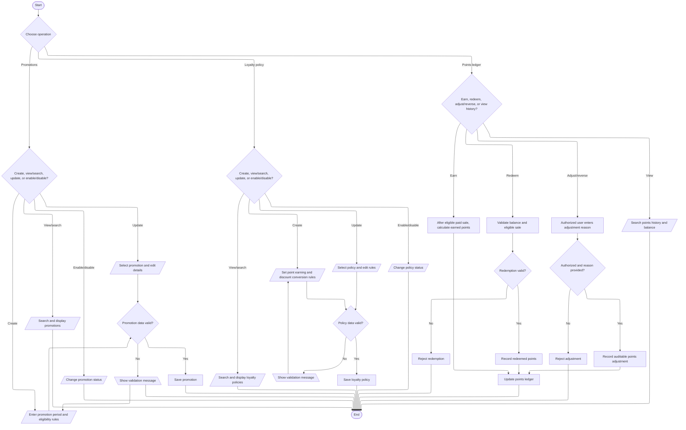
```mermaid
%%{init: {"layout": "elk", "flowchart": {"nodeSpacing": 70, "rankSpacing": 90, "htmlLabels": false}}}%%
flowchart TD
    A([Start]) --> B{"Choose operation"}
    B -- Promotions --> C{"Create, view/search, update, or enable/disable?"}
    C -- Create --> D[/Enter promotion period and eligibility rules/]
    C -- View/search --> E[/Search and display promotions/]
    C -- Update --> F[/Select promotion and edit details/]
    C -- Enable/disable --> G[/Change promotion status/]
    D --> H{"Promotion data valid?"}
    F --> H
    H -- No --> I[\Show validation message\]
    I --> D
    H -- Yes --> J["Save promotion"]
    B -- Loyalty policy --> K{"Create, view/search, update, or enable/disable?"}
    K -- Create --> L[/Set point earning and discount conversion rules/]
    K -- View/search --> M[/Search and display loyalty policies/]
    K -- Update --> N[/Select policy and edit rules/]
    K -- Enable/disable --> O[/Change policy status/]
    L --> P{"Policy data valid?"}
    N --> P
    P -- No --> Q[\Show validation message\]
    Q --> L
    P -- Yes --> R["Save loyalty policy"]
    B -- Points ledger --> S{"Earn, redeem, adjust/reverse, or view history?"}
    S -- Earn --> T["After eligible paid sale, calculate earned points"]
    S -- Redeem --> U["Validate balance and eligible sale"]
    U --> V{"Redemption valid?"}
    V -- No --> W["Reject redemption"]
    V -- Yes --> X["Record redeemed points"]
    S -- Adjust/reverse --> Y["Authorized user enters adjustment reason"]
    Y --> AA{"Authorized and reason provided?"}
    AA -- No --> AB["Reject adjustment"]
    AA -- Yes --> AC["Record auditable points adjustment"]
    S -- View --> AD[/Search points history and balance/]
    T --> AE["Update points ledger"]
    X --> AE
    AC --> AE
    E --> Z([End])
    G --> Z
    J --> Z
    I --> Z
    M --> Z
    O --> Z
    R --> Z
    W --> Z
    AB --> Z
    AD --> Z
    AE --> Z
```

## UC-19 — Order and Revenue Reports

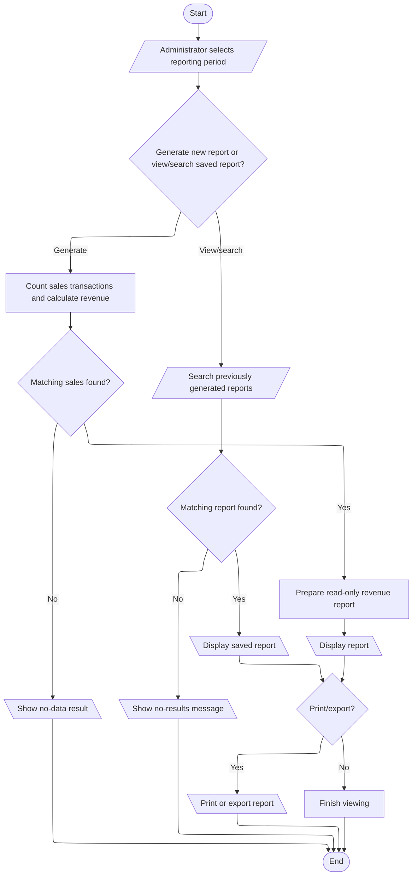
```mermaid
%%{init: {"layout": "elk", "flowchart": {"nodeSpacing": 70, "rankSpacing": 90, "htmlLabels": false}}}%%
flowchart TD
    A([Start]) --> B[/Administrator selects reporting period/]
    B --> C{"Generate new report or view/search saved report?"}
    C -- Generate --> D["Count sales transactions and calculate revenue"]
    D --> E{"Matching sales found?"}
    E -- No --> F[\Show no-data result\]
    E -- Yes --> G["Prepare read-only revenue report"]
    C -- View/search --> H[/Search previously generated reports/]
    H --> I{"Matching report found?"}
    I -- No --> J[\Show no-results message\]
    I -- Yes --> K[\Display saved report\]
    G --> L[\Display report\]
    L --> M{"Print/export?"}
    K --> M
    M -- Yes --> N[\Print or export report\]
    M -- No --> O["Finish viewing"]
    F --> Z([End])
    J --> Z
    N --> Z
    O --> Z
```
